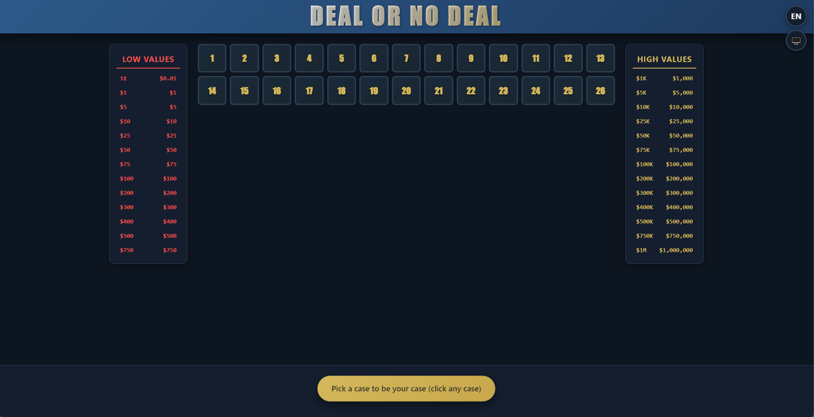
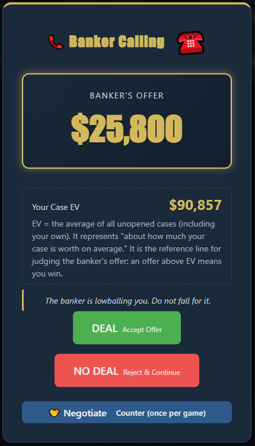
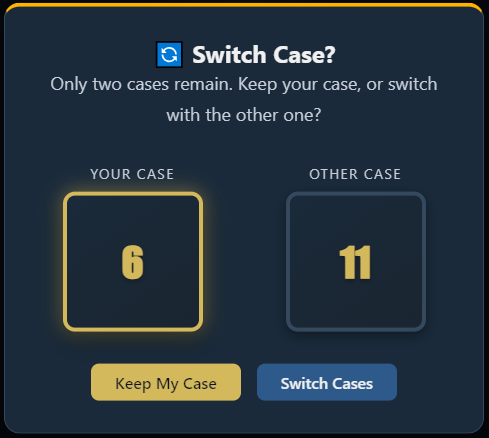
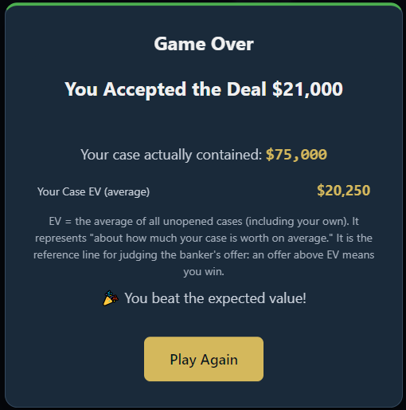
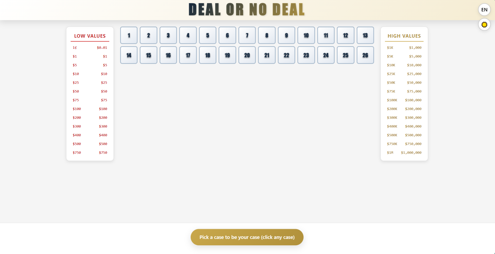
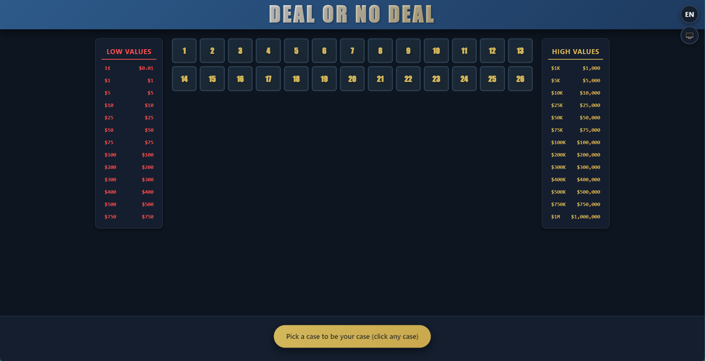

# Deal or No Deal - Classic US Edition

A faithful, fully client-side recreation of the classic American TV game show
**Deal or No Deal**, built with plain HTML, CSS, and JavaScript. There is **no
build step and no dependencies** — you can open `index.html` directly in any
modern browser (including from the `file://` protocol) and start playing.

> **Language / 语言:** [中文](README.zh.md) | English

## Table of Contents

- [Overview](#overview)
- [Features](#features)
- [How to Play](#how-to-play)
- [Screenshots](#screenshots)
- [How to Run](#how-to-run)
- [Project Structure](#project-structure)
- [Architecture and How It Works](#architecture-and-how-it-works)
  - [Module Responsibilities](#module-responsibilities)
  - [Module Reference (Key APIs)](#module-reference-key-apis)
  - [Game State Model](#game-state-model)
  - [Round / Game Flow](#round--game-flow)
  - [Expected Value](#expected-value)
  - [Banker Offer Algorithm](#banker-offer-algorithm)
  - [Haggle (Counter-Offer) Mechanic](#haggle-counter-offer-mechanic)
  - [Switch Case Endgame](#switch-case-endgame)
  - [Robustness & Concurrency Safeguards](#robustness--concurrency-safeguards)
  - [Developer Options (Easter Egg)](#developer-options-easter-egg)
- [Theming](#theming)
- [Internationalization (i18n)](#internationalization-i18n)
- [Animations](#animations)
- [Audio](#audio)
- [Accessibility](#accessibility)
- [Persistence](#persistence)
- [Customization](#customization)
- [Browser Support](#browser-support)
- [Debug API](#debug-api)
- [License](#license)
- [Star History](#star-history)

## Overview

In *Deal or No Deal* the player is presented with **26 sealed cases**, each
containing one of 26 monetary amounts from **$0.01 to $1,000,000** (the standard
US prize ladder). One case is randomly assigned to the player and kept hidden for
the entire game. In each round the player opens a fixed number of the remaining
*other* cases, revealing their amounts and removing them from play. After every
round the **Banker** calls with a cash offer to buy the player's case. The player
must choose **DEAL** (sell the case for the offer) or **NO DEAL** (keep playing).
The goal is to beat the **expected value (EV)** of the player's still-unknown
case.

This project reproduces the show's tension with:

- A stage-aware, non-linear **Banker AI** (with "bait" offers and edge-case
  logic for "all-low" and "million-or-nothing" boards).
- A once-per-game **Haggle** counter-offer mini-mechanic.
- A live **Expected Value** read-out with a plain-language explanation, shown
  next to every offer and in the final summary.
- A polished, animated UI: 3D case flips, a "fly-to-your-case" selection
  animation, phone-ring drama, an offer pulse, a result reveal, a player-case
  glow, a case-swap animation, and modal transitions.
- Full **Light / Dark / System** theming and **Chinese / English / System**
  localization (all UI strings, Banker commentary, and dynamic text localized).
- Screen-reader and keyboard support, plus `prefers-reduced-motion` and
  `prefers-contrast: high` handling.
- A hidden **Developer Options** panel (unlocked by an easter egg) to inspect the
  board without spoiling the game.
- Robust **concurrency safeguards** (a "generation" token and a "decision lock")
  so that restarts, double-clicks, and stale timers can never corrupt a game.

The whole game is **zero-dependency, zero-build static files**. Scripts are
loaded as classic `<script>` tags in dependency order, which is exactly why it
runs from `file://` without a server or module/CORS issues.

## Features

- **Gameplay:** 26 cases, 9 opening rounds (6/5/4/3/2/1/1/1/1 cases opened per
  round = 24 total), a Banker offer after each of the first 8 rounds, then a
  final **Switch-Case** decision between your case and the last remaining case.
- **Banker AI:** stage-based percentage of EV, triangular-random distribution,
  plus/minus 5–12% volatility, bait offers after 3 consecutive rejections,
  special handling for "all-low" and "million + only-low" boards, and rational
  sanity clamps.
- **Haggle:** one counter-offer per game. Accepted only if it is *above* the
  current offer and *at or below* the Banker's hidden ceiling (EV × 0.85–1.15).
  Quick **+10% / +25% / +50%** buttons prefill the input.
- **Expected Value:** live EV shown with a friendly explanation ("an offer above
  EV means you win") so casual players understand the reference line.
- **Theming:** Light, Dark, or follow System; persisted in `localStorage`;
  respects the OS color scheme.
- **i18n:** Chinese, English, or follow System; every UI string, Banker
  commentary pool, and dynamic region is localized.
- **Animations:** 3D case flip, selection "fly-to-player", phone ring, offer
  amount pulse, result reveal, player-case glow, case swap, and modal
  enter/exit transitions; auto-degrades on reduced-motion.
- **Audio:** synthesized sound effects (ring / open / deal) via the Web Audio
  API — no audio files needed.
- **Accessibility:** ARIA roles/labels, full keyboard navigation, visible focus
  rings, reduced-motion and high-contrast support.
- **Persistence:** theme, language, and lifetime game statistics in `localStorage`.
- **Responsive:** fluid grid that reflows to tablet and mobile; print stylesheet.
- **Zero-dependency:** pure static files; classic script tags loaded in
  dependency order so it runs from `file://`.
- **Developer Options:** an easter-egg panel (click the title 5×) that reveals
  case amounts *read-only* inside its own modal, without spoiling the board.

## How to Play

1. **Pick your case.** Click any of the 26 cases to make it *your* case. Its
   value stays hidden for the rest of the game.
2. **Open cases.** Each round you open a set number of the *other* cases.
   Opened amounts are struck through on the side value-boards so you can see
   which prizes are gone.
3. **The Banker calls.** After each round the Banker shows an offer and the
   *Expected Value* of your case. Decide:
   - **DEAL** — take the offer and end the game.
   - **NO DEAL** — reject and continue to the next round.
   - **Haggle** (once per game) — counter with your own amount; the Banker may
     accept (game ends as a DEAL) or reject (your only move is then NO DEAL).
4. **Final two cases.** After all 9 rounds, only your case and one other case
   remain. You may **Keep** your case or **Switch** with the other one.
5. **Reveal.** Your case (and the other case) is flipped open. Your winnings are
   compared against the EV ("🎉 You beat the expected value!" or "📉 Below
   expected value").

> **Tip:** An offer *above* the shown Expected Value is statistically a "win".
> The Banker's EV is computed over **all unopened cases, including your own**.

> **Note:** The Banker makes an offer after each of the first eight opening
> rounds. After the ninth (final) opening round there is no further offer — the
> game goes straight to the Switch-Case finale.

> **Easter egg:** click the **"DEAL OR NO DEAL"** title 5 times in quick
> succession to unlock the hidden **Developer Options** panel (see
> [Developer Options](#developer-options-easter-egg)).

## Screenshots

The game ships with a faithful US-style UI, full **Light / Dark** theming, and
**Chinese / English** localization. The four key screens below are shown in
English (Light mode):

| Main interface | A Call from the Banker |
| --- | --- |
|  |  |

| Swapping Boxes | Game Over |
| --- | --- |
|  |  |

- **Main interface** – 26 cases, the low/high value panels, your case, round
  info, and the instruction banner.
- **A Call from the Banker** – the Banker's offer, your case Expected Value,
  the commentary, and the DEAL / NO DEAL / Haggle choices.
- **Swapping Boxes** – the final two-case decision (Keep or Switch).
- **Game Over** – the reveal, your winnings vs. the Expected Value, and the stats.

The same screens are also available in **Dark mode** (shown here in English):

| Light mode | Dark mode |
| --- | --- |
|  |  |

Chinese-localized versions of every screen are included in the
[`screenshots/`](screenshots/) folder as well.

## How to Run

No installation or build is required.

```bash
# Option A - just open the file
open index.html              # macOS
xdg-open index.html          # Linux
start index.html             # Windows

# Option B - serve it (any static server)
python3 -m http.server 8000  # then visit http://localhost:8000
```

Because the project uses classic scripts (not ES modules), it works perfectly
when opened directly from disk via `file://`. A static server is optional.

## Project Structure

```
Deal Or No Deal/
├── index.html            # All markup: top controls, game board, modals
├── css/
│   ├── variables.css     # Design tokens + Light/Dark theme custom properties
│   ├── base.css          # Reset, utilities, buttons, modals, haggle UI, dev UI
│   ├── layout.css        # Game board, panels, cases, modals, responsive, print
│   └── animations.css    # Keyframes + motion (flips, ring, reveal, fly, swap)
└── js/
    ├── i18n.js           # Translation dictionary + t() + language resolve + applyStaticI18n
    ├── config.js         # Constants: values, rounds, banker params, timing, helpers
    ├── state.js          # Central game state + StateManager facade
    ├── banker.js         # Offer calculation, drama delay, commentary, haggle resolve
    ├── ui.js             # DOM rendering, animations, events, audio, dev options
    └── main.js           # GameController: orchestration, flow, theme & language
```

Scripts are loaded **in dependency order** at the bottom of `index.html`:
`i18n -> config -> state -> banker -> ui -> main`. Cross-file communication uses
globally-scoped `const`/`function` (no `import`/`export`), which is what makes
`file://` opening work.

### CSS files

- **variables.css** — every color, spacing, radius, shadow, and font token as a
  CSS custom property, plus the `:root` (light) and `[data-theme="dark"]`
  overrides. Re-skin the whole game here without touching JS.
- **base.css** — a small reset, layout utilities, button styles (`.btn`,
  `.btn--deal`, `.btn--no-deal`, `.btn--haggle`, …), modal primitives, the
  haggle input/quick-add UI, and the developer-options UI.
- **layout.css** — the three-column game board (low panel / cases grid / high
  panel), the "your case" display, round-info bar, responsive grid breakpoints
  (desktop 13 columns, tablet/mobile 7 columns), and print rules.
- **animations.css** — all `@keyframes` (case flip, phone ring, offer pulse,
  banner out, modal enter/exit, reveal, fly, swap) and the
  `prefers-reduced-motion` overrides.

## Architecture and How It Works

The app follows a clean **separation of concerns**:

- **config.js** — pure data and stateless helpers (no DOM, no state).
- **state.js** — the single source of truth: a plain `state` object plus a
  `StateManager` facade. UI and controller read/write only through it.
- **banker.js** — pure game logic for offers and haggling; reads `StateManager`.
- **ui.js** — all DOM rendering, animations, event wiring, sound, and the dev
  panel.
- **main.js** — the `GameController` that ties events → state → UI and drives the
  round / offer / endgame flow, plus theme & language handling.

This keeps the game logic deterministic and easy to reason about; the only side
effects live in `ui.js` (DOM/audio) and `state.js` (localStorage stats).

### Module Responsibilities

| Module | Responsibility |
| --- | --- |
| `i18n.js` | Holds the `I18N` dictionary (zh/en), `t(key, params)` lookup with `{placeholder}` substitution, `resolveLanguage()`, `applyStaticI18n()` for `data-i18n` elements, and `LANG_STORAGE_KEY`. |
| `config.js` | `CASE_VALUES`, `LOW_VALUE_COUNT`, `ROUND_CONFIG`, `TOTAL_ROUNDS`, `BANKER_CONFIG`, `TIMING`, `GAME_PHASE`, `CASE_STATE`, `STORAGE_KEYS`, plus helpers `formatCurrency`, `isHighValue`, `getValueClass`, `shuffleArray`, `generateCaseNumbers`, `getValueLabel`. |
| `state.js` | The `state` object and the `StateManager` API (`reset`, `initializeCases`, `selectPlayerCase`, `openCase`, `advanceRound`, `enterSwitchCase`, `setBankerOffer`, `acceptDeal`, `rejectDeal`, `keepCase`, `switchCase`, `calculateExpectedValue`, `getResultSummary`, `updateStats`, …). |
| `banker.js` | `calculateBankerOffer()` (the algorithm), `generateBankerOfferWithDrama()` (async delay), `getOfferCommentary()`, `resolveHaggle()`, plus `triangularRandom` / `randomInRange` / `roundOffer` helpers. |
| `ui.js` | Element caching, `renderMoneyPanels` / `renderCasesGrid`, all `animate*` functions, `showBankerOffer` / `showSwitchCase` / `showResult`, the haggle UI, `bindEvents`, `playSound`, and the developer-options panel. Exposes the `UI` object. |
| `main.js` | `GameController` with `init`, theme & language handlers, `handleCaseClick`, `triggerBankerOffer`, `handleDeal`/`handleNoDeal`/`handleKeep`/`handleSwitch`/`handleRestart`, `handleHaggle*`, and the `generation`/`decisionLock` safeguards. |

### Module Reference (Key APIs)

**`StateManager` (state.js)** — the only stateful module:

- `reset()` — restore the initial state and reload stats.
- `initializeCases()` — shuffle `CASE_VALUES` across cases 1–26 (Fisher-Yates).
- `selectPlayerCase(n)` — mark case `n` as the player's case; remove it from the
  *openable* list but keep its value in `remainingValues`.
- `openCase(n)` — open an opponent case; updates `remainingCases`, `openedCases`,
  and `remainingValues`; returns `{ caseNumber, value, isHighValue }`.
- `isRoundComplete()` — `openedThisRound >= boxesToOpenThisRound`.
- `advanceRound()` — move to the next round, or call `enterSwitchCase()` after
  the last round.
- `enterSwitchCase()` — set `otherCaseNumber` / `otherCaseValue` (the last case).
- `setBankerOffer(offer)` — record the current offer + push an offer-history row.
- `acceptDeal()` / `rejectDeal()` / `keepCase()` / `switchCase()` — finalize the
  outcome and capture `finalWinnings` plus the decision-time EV.
- `calculateExpectedValue()` — `sum(remainingValues) / remainingValues.length`.
- `getResultSummary()` — `{ finalWinnings, playerCaseValue, otherCaseValue,
  expectedValue, decision, offerHistory, isDeal, beatExpected }`.

**`banker.js`**:

- `calculateBankerOffer()` → `{ offer, isBait }`.
- `generateBankerOfferWithDrama()` — awaits a short "thinking" delay (from
  `TIMING`) then returns `calculateBankerOffer()`.
- `getOfferCommentary(offer, ev, isBait)` — picks a localized line from the
  `banker.comments.*` pools based on the offer/EV ratio.
- `resolveHaggle(counter, originalOffer, ev)` → `{ accepted, finalOffer, ceiling }`.

**`UI` (ui.js)** exposes: `renderMoneyPanels`, `renderCasesGrid`,
`animateCaseOpen`, `animatePlayerCaseSelection`, `updateRoundInfo`,
`showBankerOffer` / `hideBankerOffer`, `showSwitchCase` / `hideSwitchCase`,
`showResult` / `hideResult`, `animatePlayerCaseOpen`, `resetUI`, `applyI18n`,
`bindEvents`, `setButtonDisabled`, `playSound`, `updateHaggleUI`, `showHagglePanel`
/ `hideHagglePanel` / `getHaggleInputValue` / `setOfferDisplay` /
`showHaggleResult`, and the developer-options methods
(`showDevOptions`, `devRevealAllCases`, `devRevealRemainingCases`,
`devRevealPlayerCase`).

### Game State Model

The `state` object (in `state.js`) tracks:

| Field | Meaning |
| --- | --- |
| `phase` | `selecting_player_case` → `opening_cases` → `banker_offer` → `switch_case` → `game_over` |
| `caseAssignments` | `Map<caseNumber, value>` — the hidden board |
| `playerCaseNumber` / `playerCaseValue` | the player's chosen (still secret) case |
| `remainingCases` | cases not yet opened (excludes the player's case) |
| `openedCases` | `Map<caseNumber, value>` of revealed cases |
| `remainingValues` | **all** unopened values **including the player's case** (used for EV) |
| `currentRoundIndex` | 0-based round counter |
| `openedThisRound` / `boxesToOpenThisRound` | progress within a round |
| `offerHistory` / `currentOffer` | Banker offer tracking |
| `consecutiveRejects` | drives bait-offer logic |
| `haggleUsed` | ensures the haggle is once-per-game |
| `otherCaseNumber` / `otherCaseValue` | the final-2 opponent case |
| `finalDecision` / `finalWinnings` / `isGameOver` | outcome |
| `stats` | lifetime `{ gamesPlayed, gamesWon, totalWinnings, bestWin }` |

> **Important EV detail:** `remainingValues` intentionally keeps the player's
> case value until that case is actually opened. So the Expected Value is the
> mean of *all* unopened cases — a correct "what is my case worth on average
> right now" figure.

### Round / Game Flow

```
SELECT CASE --> OPEN CASES (per ROUND_CONFIG) --> BANKER OFFER
                                                     |
                          +--------------------------+
                          v                          v
                      (NO DEAL)                  (DEAL)
                          |                          |
             last round? --No--> next round         +--> GAME OVER (reveal)
                          |
                         Yes
                          v
                SWITCH CASE (keep / switch) --> GAME OVER (reveal)
```

Rounds open **6, 5, 4, 3, 2, 1, 1, 1, 1** other cases (24 total), leaving the
player's case plus exactly one other case for the Switch-Case finale.

### Expected Value

```js
calculateExpectedValue() = sum(remainingValues) / remainingValues.length
```

The value is displayed beside every Banker offer and in the final summary,
accompanied by a plain-language explainer (key `ev.explainer`) so players
understand the reference line. The "beat the EV" win/lose badge in the result
screen compares `finalWinnings` against the **decision-time** EV (captured the
moment you DEAL / KEEP / SWITCH), which is the only meaningful reference at that
point.

### Banker Offer Algorithm

Implemented in `calculateBankerOffer()` (`banker.js`):

1. Compute the **Expected Value** of all remaining cases.
2. Choose a base percentage by **stage**:
   - Early rounds (1–3): **15%–35%** of EV
   - Mid rounds (4–6): **40%–65%** of EV
   - Late rounds (7–9): **70%–92%** of EV
3. Pick the percentage via a **triangular distribution** centered on the stage
   midpoint (so "typical" offers are more likely than extremes).
4. Apply **volatility** of plus/minus 5% to 12% in a random direction.
5. **Bait offer:** after **3+ consecutive rejections**, there is a 30% chance
   the Banker adds an extra **+5% to +15%** "sweetener" to lure a DEAL.
6. **Board-aware tweaks:**
   - If only *low* values remain, the offer is bumped **+10% to +20%** (the cap
     is relaxed to 1.05× the max remaining so the bonus is actually felt).
   - If the only remaining high value is **$1,000,000** with everything else
     sub-$1,000 ("million or nothing"), the offer is discounted to **85%**.
7. **Sanity clamps:** offer is capped at 95% of the max remaining value and
   floored at the min remaining value; anything non-finite or ≤ 0 falls back to
   the min remaining value (at least $0.01).
8. **Rounding:** amounts below $1 round to the nearest cent (so $0.01 stays
   $0.01); amounts from $1 up to under $1,000 round to the nearest $1; amounts
   at or above $1,000 round to the nearest $100.

The offer is then delivered via `generateBankerOfferWithDrama()`, which inserts a
short "Banker thinking" delay before resolving. The pacing of the whole
*"last case opened → Banker call"* chain is centralized in the `TIMING` config:

| Timing key | Default | Meaning |
| --- | --- | --- |
| `roundCompleteToBankerCall` | 250 ms | gap after the last case of a round opens |
| `bankerThinkMin` / `bankerThinkMax` | 350 / 700 ms | random "thinking" delay |
| `bankerRingDuration` | 900 ms | decorative phone-ring animation (non-blocking) |

### Haggle (Counter-Offer) Mechanic

Once per game the player may counter the Banker's offer:

```js
resolveHaggle(counter, originalOffer, expectedValue):
    ceiling = expectedValue * random(0.85, 1.15)   // Banker's hidden max
    accepted = counter > originalOffer && counter <= ceiling
```

- The counter must be **strictly above the current offer** (the Banker will not
  "lower" the price) **and at or below** the Banker's hidden ceiling.
- **Accepted** — the counter becomes the final offer and the game ends as a DEAL.
- **Rejected** — the original offer is voided and the game force-continues as NO
  DEAL. This counts as a genuine rejection (it increments `consecutiveRejects`,
  which can later trigger bait offers), and you do **not** get a second haggle.
- Quick-add buttons (**+10% / +25% / +50%** of the current offer) prefill the
  input. The `+50%` button is the only one guaranteed to clear the `> original`
  bar for typical offers.

### Switch Case Endgame

When only two cases remain, the UI shows both. The player chooses **Keep** or
**Switch**. Internally `keepCase()` pays the player's own value, while
`switchCase()` swaps the displayed values and pays the *other* case's value
(`finalWinnings = otherCaseValue`). The reveal then opens the player's (new) case
dramatically. The "beat the EV" comparison in the result uses the decision-time
EV (the mean of the final two cases).

### Robustness & Concurrency Safeguards

The game is defensive against timing races and rapid input, which is important
because several steps are asynchronous (case-flip animations, the Banker's
"thinking" delay, haggle-result delays, and the result reveal delay):

- **`generation` token** — `GameController.init()` and `handleRestart()`
  increment `this.generation`. Every deferred callback (Banker offer, haggle
  settle, result reveal) captures the generation it was created in and checks
  `gen === this.generation` before acting. A "Play Again" therefore invalidates
  any pending callbacks from the previous game, so a stale offer or reveal can
  never be applied to a fresh board (this also prevents "ghost" result modals).
- **`decisionLock`** — a boolean guard around each terminal decision (DEAL / NO
  DEAL / KEEP / SWITCH / haggle-submit). It is set the moment a decision starts
  and only released when the *next* decision point is genuinely ready (e.g. after
  the Banker modal's transition window, or right before `showSwitchCase`). This
  prevents double-fire from fast double-clicks, an `Esc` pressed during a modal's
  close window, or a haggle settle firing into an already-decided game.
- **Single source of truth** — `getState()` returns a shallow copy, so numeric
  fields like `phase` / `openedThisRound` are always read fresh via `StateManager`
  methods rather than from a stale snapshot.

### Developer Options (Easter Egg)

The title **"DEAL OR NO DEAL"** hides an easter egg. Click it **5 times within 2
seconds** (`TITLE_CLICK_THRESHOLD = 5`, `TITLE_CLICK_RESET_MS = 2000`) and a
**Developer Options** modal opens with three read-only inspectors:

- **Reveal All Cases** — lists all 26 cases with their real amounts; your case is
  marked with a ★.
- **Reveal Remaining Cases** — lists only the still-unopened cases (your case
  still counts as "remaining" and is marked ★); opened cases are excluded.
- **Reveal My Case** — shows just your own case's amount.

Crucially, the dev panel is **read-only**: it renders amounts only *inside* its
own modal and never writes them onto the board or the side value-panels. So you
can peek without permanently spoiling the game (closing the modal leaves the
board exactly as hidden as before). The result text for each action is localized
via the `dev.*` i18n keys.

## Theming

- Toggle via the moon/sun/monitor button (top-right). Choices: **Light**,
  **Dark**, **System** (follow OS via `prefers-color-scheme`).
- Active preference is stored under `localStorage` key `don_theme_preference`.
- All colors are CSS custom properties in `css/variables.css`; switching only
  flips the `data-theme` attribute on the `<html>` element. When "System" is
  chosen, a `matchMedia('(prefers-color-scheme: dark)')` listener keeps the
  effective theme in sync if the OS scheme changes.

## Internationalization (i18n)

- Toggle via the 中/EN/ globe button (top-right). Choices: **Chinese**,
  **English**, **System** (uses `navigator.language`; anything starting with `en`
  becomes English, otherwise Chinese).
- Preference stored under `localStorage` key `don_lang_preference`.
- `i18n.js` holds flat dot-notation keys (for example `round.current`,
  `banker.comments.low`) for both languages. `applyStaticI18n()` swaps text on
  elements marked with `data-i18n` (and attributes via `data-i18n-attr`, e.g.
  `title,aria-label`), while `UI.applyI18n()` refreshes dynamic regions (round
  info, result modal).
- The Banker's random commentary pools are localized too. Placeholders use the
  `{name}` syntax and are substituted by `t(key, { name: value })`.

## Animations

All motion is defined as CSS `@keyframes` in `css/animations.css` and triggered
by class toggles in `ui.js`. The major animations:

- **Case flip** — a 3D `rotateY` flip reveals the amount on the back of an opened
  case (`.case--flipping` → `.case--opened`).
- **Fly-to-player** — when you pick your case, a clone "flies" from the grid cell
  to the "Your Case" slot (`case-fly` + `requestAnimationFrame` transform); the
  banner glides out and the rest of the grid gently settles.
- **Phone ring** — a decorative ring/pulse on the ☎️ icon while the Banker modal
  appears (non-blocking; buttons are already active).
- **Offer pulse** — the offer amount scales/pulses in (`.banker-modal__amount--animating`).
- **Result reveal** — the summary and details fade/slide in
  (`.result-modal__summary--reveal`, `.result-modal__details--reveal`) after a
  short delay; the "Play Again" button reveals last.
- **Player-case glow / open** — your case box glows, then flips open to reveal its
  real amount (`animatePlayerCaseOpen`).
- **Case swap** — in the Switch finale, both boxes briefly animate
  (`.switch-case__box--swapping`) before the swap is applied.
- **Modal transitions** — every modal uses `modal-enter` / `modal-exit` on its
  centered content layer, with a shared `modal-backdrop-enter/exit` behind it.

**Reduced motion:** when the user prefers reduced motion (or the browser reports
a reduced-motion media query), the fly-to-player animation is skipped and the
case is shown in place; essential transitions are shortened or removed.

## Audio

Sound effects are **synthesized at runtime** with the Web Audio API
(`ui.js` → `playSound('ring' | 'open' | 'deal')`); there are no audio files to
download. The `AudioContext` is created on the player's first interaction
(click/keydown/touch) to satisfy browser autoplay policies, and resumed if it was
suspended. Three cues exist:

- **ring** — the Banker's phone call (two-tone chime).
- **open** — a case being opened (rising blip).
- **deal** — a pleasant arpeggio when you DEAL / KEEP / SWITCH.

Errors are swallowed silently (e.g. if the context cannot start), so audio never
blocks gameplay.

## Accessibility

- Cases are `role="button"`, `tabindex="0"`, with localized `aria-label` values.
- **Keyboard:**
  - **Arrow keys** move focus between unopened cases (skipping opened cells and
    the player-case placeholder; jumps over the placeholder cell when navigating).
  - **Enter / Space** opens the focused case.
  - **D** = DEAL, **N** = NO DEAL (during an offer; ignored when buttons are
    disabled or a haggle input is focused).
  - **Esc** dismisses the Banker/Switch modals (defaults to NO DEAL / Keep).
  - Clicking the title 5× quickly unlocks Developer Options.
- Visible `:focus-visible` outlines; `prefers-reduced-motion` disables
  non-essential animation; `prefers-contrast: high` strengthens borders.
- Modals use `role="dialog"`, `aria-modal`, and labelled headings; the top
  controls expose `aria-haspopup` / `aria-expanded`.

## Persistence

| Key | Contents |
| --- | --- |
| `don_theme_preference` | `'light'` | `'dark'` | `'system'` |
| `don_lang_preference` | `'zh'` | `'en'` | `'system'` |
| `don_game_stats` | lifetime stats JSON (`gamesPlayed`, `gamesWon`, `totalWinnings`, `bestWin`) |

Stats are accumulated in `StateManager.updateStats()` after every game (a game is
counted as "won" when `finalWinnings >` the **decision-time** EV) and survive
reloads. Theme and language are read on startup and applied before the first
render.

## Customization

Almost everything tunable lives in **`js/config.js`**:

- **`CASE_VALUES`** — the 26 prize amounts. Keep it length 26 for a full board, or
  change the ladder entirely. `LOW_VALUE_COUNT` (13) splits the side value-boards
  into Low/High halves.
- **`ROUND_CONFIG`** — per-round `boxesToOpen`. The sum should be 24 so that
  exactly one non-player case remains for the Switch finale. `TOTAL_ROUNDS`
  derives automatically from this array.
- **`BANKER_CONFIG`** — stage percentage ranges (`early`/`mid`/`late`),
  `volatility`, `baitTriggerRejects` (default 3) and `baitBonus`, plus rounding
  thresholds (`roundingThreshold`, `roundingSmall`, `roundingLarge`).
- **`TIMING`** — pacing in ms: gap before the Banker calls
  (`roundCompleteToBankerCall`), "thinking" delay (`bankerThinkMin/Max`), and the
  decorative ring duration (`bankerRingDuration`).
- **`GAME_PHASE` / `CASE_STATE`** — the phase and case-state enums referenced
  throughout the code.
- Helper functions: `formatCurrency`, `isHighValue`, `getValueClass`,
  `shuffleArray` (Fisher-Yates), `generateCaseNumbers`, `getValueLabel`.

Theme tokens, button colors, and layout dimensions are all CSS variables in
`css/variables.css` and can be re-skinned without touching JS.

## Browser Support

- Modern evergreen browsers (Chrome, Edge, Firefox, Safari) that support CSS
  custom properties, `aspect-ratio`, `backdrop-filter`, and the Web Audio API.
- Works from `file://` (no module/CORS issues) and from any static host.

## Debug API

For development, the page exposes a global `window.DealOrNoDeal` with direct
access to the core objects:

```js
window.DealOrNoDeal.StateManager   // state facade
window.DealOrNoDeal.GameController // flow controller
window.DealOrNoDeal.UI             // rendering/animation helpers
```

Open the browser console to inspect `StateManager.getState()`, force offers, or
step through the game programmatically.

## License

This project is licensed under the [MIT License](LICENSE).

## Star History

<a href="https://www.star-history.com/?repos=ljy969%2FDEAL-OR-NO-DEAL&type=date&legend=top-left">
 <picture>
   <source media="(prefers-color-scheme: dark)" srcset="https://api.star-history.com/chart?repos=ljy969/DEAL-OR-NO-DEAL&type=date&theme=dark&legend=top-left&sealed_token=wuYBrwi7UXn1fHsg9MnezI9qEsNr2V-zl8dNKc2HdFCqnZ5lL3cIdg4J-SB8O4NC1QZGv9FemJ23m9bXX_1WVYgZWA6Pyh20d66vsbuZOTVquQIXAeJGuA" />
   <source media="(prefers-color-scheme: light)" srcset="https://api.star-history.com/chart?repos=ljy969/DEAL-OR-NO-DEAL&type=date&legend=top-left&sealed_token=wuYBrwi7UXn1fHsg9MnezI9qEsNr2V-zl8dNKc2HdFCqnZ5lL3cIdg4J-SB8O4NC1QZGv9FemJ23m9bXX_1WVYgZWA6Pyh20d66vsbuZOTVquQIXAeJGuA" />
   
 </picture>
</a>
