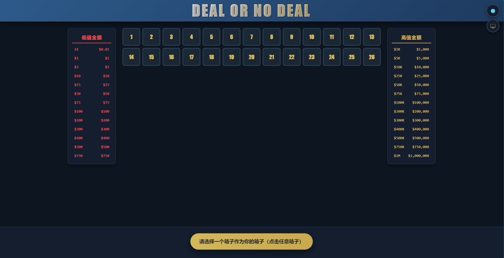
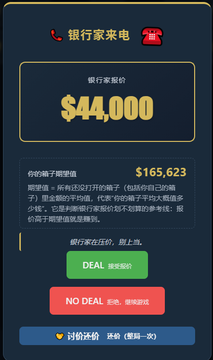
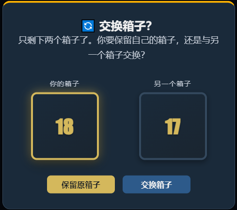
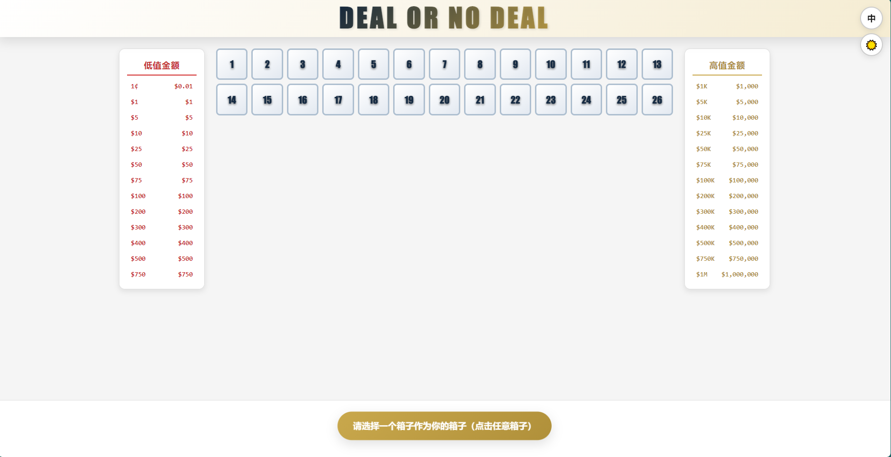
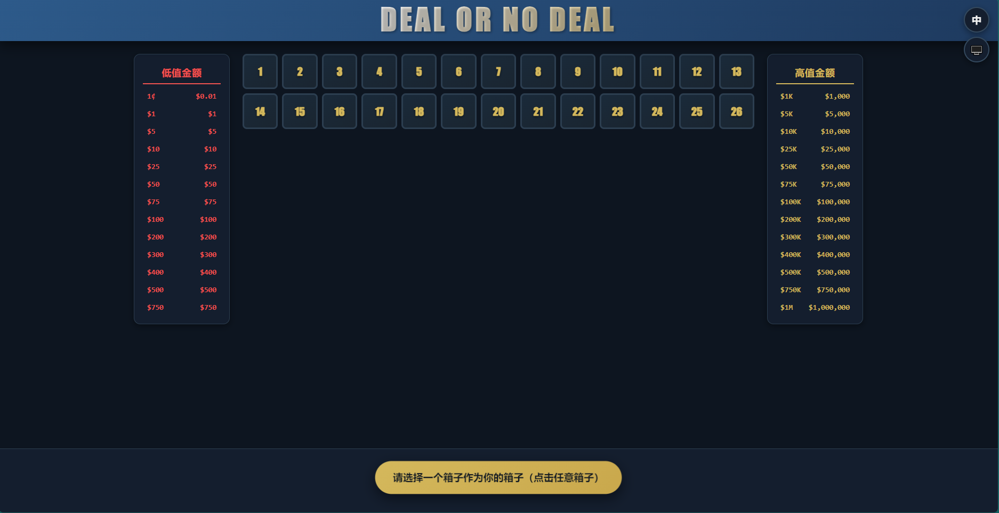

# Deal or No Deal —— 美版经典游戏

这是一个完全客户端运行的《Deal or No Deal》（一掷千金 / 交换密码）美版经典电视
游戏的高还原复刻版，使用纯 HTML、CSS 和 JavaScript 编写。**无需构建、没有任何
第三方依赖**——直接用浏览器打开 `index.html`（包括通过 `file://` 协议）即可
开始游玩。

>  **语言 / Language:** 中文 | [English](README.md)

## 目录

- [项目简介](#项目简介)
- [主要功能](#主要功能)
- [玩法说明](#玩法说明)
- [截图](#截图)
- [运行方式](#运行方式)
- [项目结构](#项目结构)
- [架构与工作原理](#架构与工作原理)
  - [各模块职责](#各模块职责)
  - [模块接口参考（核心 API）](#模块接口参考核心-api)
  - [游戏状态模型](#游戏状态模型)
  - [回合 / 游戏流程](#回合--游戏流程)
  - [期望值](#期望值)
  - [银行家报价算法](#银行家报价算法)
  - [讨价还价（还价）机制](#讨价还价还价机制)
  - [交换箱子终局](#交换箱子终局)
  - [健壮性与会话防护](#健壮性与会话防护)
  - [开发者选项（彩蛋）](#开发者选项彩蛋)
- [主题切换](#主题切换)
- [国际化（i18n）](#国际化i18n)
- [动画](#动画)
- [音效](#音效)
- [无障碍支持](#无障碍支持)
- [数据持久化](#数据持久化)
- [自定义配置](#自定义配置)
- [浏览器兼容性](#浏览器兼容性)
- [调试接口](#调试接口)
- [许可证](#许可证)
- [Star 历史](#star-历史)

## 项目简介

在《Deal or No Deal》中，玩家面对 **26 个密封箱子**，每个箱子装着 26 个固定
奖金中的一个，金额从 **$0.01 到 $1,000,000**（美版标准奖金阶梯）。其中一个箱子
会被随机分配给玩家并一直保密。每一轮玩家要打开若干个其余的箱子，揭开里面的
金额并将其从游戏中移除。每轮结束后，**银行家（Banker）**会打来电话，出一个现金
价格收购玩家的箱子。玩家必须选择 **DEAL（成交）** 或 **NO DEAL（不成交，继续）**。
目标是在游戏结束时，让最终收益超过自己箱子当前的**期望值（EV）**。

本项目高度还原了节目的悬念感，具备以下特性：

- 分阶段、非线性的“银行家 AI”（含诱饵报价与多种边界情况处理，如“全低值”
  “百万孤注一掷”等牌面）。
- 整局限一次的**讨价还价（Haggle）**还价小机制。
- 实时的**期望值**展示，并附带通俗易懂的文字解释，显示在每次报价旁及最终结算中。
- 精致的动画 UI（3D 翻箱、选箱“飞入”动画、电话铃动效、报价脉冲、结算揭晓、
  玩家箱子发光、交换动画与弹窗过渡）。
- 完整的**浅色 / 深色 / 跟随系统**主题，以及**中文 / English / 跟随系统**语言
  切换（所有界面文案、银行家评语池、动态区域均本地化）。
- 屏幕阅读器与键盘支持，并适配“减少动画（prefers-reduced-motion）”与
  “高对比度（prefers-contrast: high）”偏好。
- 一个隐藏的**开发者选项**面板（通过彩蛋解锁），可查看牌面但不破坏游戏隐藏性。
- 健壮的**会话防护**（generation 代次令牌 + decisionLock 决策锁），让“重新开始”、
  快速双击、过期定时器都无法破坏一局游戏。

整个游戏是**零依赖、零构建的静态文件**。脚本以经典 `<script>` 标签按依赖顺序
加载，这正是它能以 `file://` 直接打开、无需服务器或模块/CORS 问题的原因。

## 主要功能

- **核心玩法：** 26 个箱子、9 个开箱回合（每轮依次打开 6/5/4/3/2/1/1/1/1 个
  其他箱子，共 24 个），每个开箱回合结束后银行家都会出价（共 9 次），最后进入
  “交换箱子”终局，在“你的箱子”与“最后剩下的一个箱子”之间做决策。
- **银行家 AI：** 按阶段给出基于期望值的百分比报价，采用三角分布随机、±5%~±12%
  波动，连续拒绝 3 次后可能触发诱饵报价，并对“全低值”“百万孤注一掷”等特殊牌面
  做专门处理，还带有合理的上下限钳制。
- **讨价还价：** 整局一次还价机会；只有当还价**高于当前报价**且**不超过**银行家
  隐藏上限（期望值 ×0.85~1.15）时才会被接受。提供“+10% / +25% / +50%”快捷按钮
  自动填入。
- **期望值：** 每次银行家报价旁都会显示期望值，并配有白话解释（“报价高于期望值就是
  赚到”），普通玩家也能判断“这个报价划不划算”。
- **主题：** 浅色、深色、跟随系统，持久化保存到 localStorage，并响应操作系统配色。
- **国际化：** 中文、英文、跟随系统；所有界面文案、银行家评语池以及动态文本均本地化。
- **动画：** 3D 翻箱、选箱飞入、电话铃、报价数字脉冲、结算揭晓、玩家箱子发光、交换
  动画与弹窗过渡；在“减少动画”偏好下自动降级。
- **音效：** 使用 Web Audio API 实时合成（铃声 / 开箱 / 成交 / 胜利 / 失败）音效，无需任何音频文件。
- **无障碍：** ARIA 角色与标签、完整键盘导航、可见焦点环、减少动画与高对比度支持。
- **持久化：** 主题、语言、以及累计游戏统计均保存在 localStorage。
- **响应式：** 流式网格可自适应平板与手机布局；附带打印样式。
- **零依赖：** 纯静态文件；以经典 script 标签按依赖顺序加载，因此可直接以 `file://`
  打开。
- **开发者选项：** 一个彩蛋面板（连点标题 5 次解锁），以“只读”方式在其专属弹窗内
  显示箱子金额，不破坏棋盘隐藏性。

## 玩法说明

1. **选择你的箱子。** 点击 26 个箱子中的任意一个，将其设为“你的箱子”，其金额在
   整局游戏中保持隐藏。
2. **开箱。** 每轮你要打开若干个“其他”箱子。被揭开的金额会在两侧奖金面板上
   被划掉，方便你看到哪些奖项已经没了。
3. **银行家来电。** 每轮结束后，银行家会展示一个报价以及你箱子的*期望值*。此时
   你需要决定：
   - **DEAL（成交）**——接受报价，游戏结束。
   - **NO DEAL（不成交）**——拒绝并进入下一轮。
   - **讨价还价（整局一次）**——还一个你期望的金额；银行家可能接受（游戏以 DEAL
     结束），也可能拒绝（此时你只能选择 NO DEAL）。
4. **最后两个箱子。** 9 轮结束后，场上只剩你的箱子和另一个箱子。你可以选择
   **保留原箱子**或**与另一个箱子交换**。
5. **揭晓。** 你的箱子（以及另一个箱子）会被翻转打开，最终收益与期望值进行比较
   （“🎉 你战胜了期望值！”或“📉 低于期望值”）。

> **小贴士：** 报价*高于*所显示的期望值，从统计上就是“赚到了”。银行家计算期望值时，
> 基于的是**所有尚未打开的箱子（包括你自己的箱子）**的平均值。

> **说明：** 银行家在**每一个**开箱回合结束后都会出价，包括第 9 个（最后一个）。
> 拒绝第 9 次报价后，游戏直接进入“交换箱子”终局——此后不再有额外的报价。

> **彩蛋：** 在快速连续 **5 次点击标题“DEAL OR NO DEAL”**，即可解锁隐藏的
> **开发者选项**面板（详见[开发者选项（彩蛋）](#开发者选项彩蛋)）。

## 截图

游戏采用高度还原的美版界面，支持完整的**浅色 / 深色**主题，以及**中文 / English**
语言切换。下面四个关键界面以中文（浅色主题）展示：

| 主界面 | 银行家来电 |
| --- | --- |
|  |  |

| 交换箱子 | 游戏结束 |
| --- | --- |
|  |  |

- **主界面**——26 个箱子、低值/高值金额面板、你的箱子、回合信息与提示横幅。
- **银行家来电**——银行家出价、你的箱子期望值、评语，以及 DEAL / NO DEAL / 讨价还价选项。
- **交换箱子**——最后两个箱子的“保留 / 交换”终局决策。
- **游戏结束**——揭晓、收益与期望值对比，以及累计统计。

同一界面也提供**深色主题**版本（以下以中文展示）：

| 浅色主题 | 深色主题 |
| --- | --- |
|  |  |

英文界面的各张截图同样包含在 [`screenshots/`](screenshots/) 文件夹中。

## 运行方式

无需安装、无需构建。

```bash
# 方式 A：直接打开文件
open index.html              # macOS
xdg-open index.html          # Linux
start index.html             # Windows

# 方式 B：用任意静态服务器托管
python3 -m http.server 8000  # 然后访问 http://localhost:8000
```

由于项目使用的是经典脚本（非 ES Module），通过 `file://` 直接打开也能完美运行，
静态服务器并非必需。

## 项目结构

```
Deal Or No Deal/
├── index.html            # 全部标记：顶部控制区、游戏棋盘、各类弹窗
├── css/
│   ├── variables.css     # 设计令牌 + 浅色/深色主题自定义属性
│   ├── base.css          # 重置样式、工具类、按钮、弹窗、还价 UI、开发者选项 UI
│   ├── layout.css        # 游戏布局、面板、箱子、弹窗、响应式、打印
│   └── animations.css    # 关键帧与动效（翻箱、铃声、揭晓、飞行、交换等）
└── js/
    ├── i18n.js           # 翻译字典 + t() 取词 + 语言解析 + applyStaticI18n
    ├── config.js         # 常量：奖金、回合、银行家参数、节奏、工具函数
    ├── state.js          # 全局游戏状态 + StateManager 门面
    ├── banker.js         # 报价计算、悬念延迟、评语、还价逻辑
    ├── ui.js             # DOM 渲染、动画、事件绑定、音效、开发者选项
    └── main.js           # GameController：流程编排、主题与语言、输入处理
```

脚本在 `index.html` 底部**按依赖顺序**加载：`i18n -> config -> state -> banker ->
ui -> main`。各文件之间通过全局作用域的 `const`/`function` 通信（不使用
`import`/`export`），这正是它能以 `file://` 直接打开的原因。

### CSS 文件

- **variables.css**——所有颜色、间距、圆角、阴影、字体令牌都以 CSS 自定义属性定义，
  并提供 `:root`（浅色）与 `[data-theme="dark"]`（深色）两套覆盖。无需改动 JS
  即可在此重新换肤。
- **base.css**——精简的重置样式、布局工具类、按钮样式（`.btn`、`.btn--deal`、
  `.btn--no-deal`、`.btn--haggle` 等）、弹窗基础件、还价输入/快捷按钮 UI，
  以及开发者选项 UI。
- **layout.css**——三栏式游戏棋盘（低值面板 / 箱子网格 / 高值面板）、“你的箱子”
  展示区、回合信息条、响应式断点（桌面 13 列、平板/手机 7 列）与打印规则。
- **animations.css**——全部 `@keyframes`（翻箱、铃声、报价脉冲、横幅离场、弹窗
  进出、揭晓、飞行、交换），以及 `prefers-reduced-motion` 的降级覆盖。

## 架构与工作原理

本项目遵循清晰的**关注点分离**原则：

- **config.js**——纯数据与无状态工具函数（不操作 DOM、不保存状态）。
- **state.js**——唯一的真相来源：一个普通的 `state` 对象，外加 `StateManager`
  门面。UI 与控制器都只通过它来读写状态。
- **banker.js**——报价与还价的纯游戏逻辑；读取 `StateManager`。
- **ui.js**——所有 DOM 渲染、动画、事件绑定与音效，以及开发者选项面板。
- **main.js**——`GameController`，负责把“事件 → 状态 → UI”串联起来，并驱动
  回合 / 报价 / 终局的完整流程，同时处理主题与语言。

这样设计使游戏逻辑确定且易于推理；唯一的副作用集中在 `ui.js`（DOM/音频）与
`state.js`（localStorage 统计）中。

### 各模块职责

| 模块 | 职责 |
| --- | --- |
| `i18n.js` | 维护 `I18N` 字典（zh/en），`t(key, params)` 取词（支持 `{占位符}` 替换）、`resolveLanguage()`、针对 `data-i18n` 元素的 `applyStaticI18n()`，以及 `LANG_STORAGE_KEY`。 |
| `config.js` | `CASE_VALUES`、`LOW_VALUE_COUNT`、`ROUND_CONFIG`、`TOTAL_ROUNDS`、`BANKER_CONFIG`、`TIMING`、`GAME_PHASE`、`CASE_STATE`、`STORAGE_KEYS`，以及工具函数 `formatCurrency`、`isHighValue`、`getValueClass`、`shuffleArray`、`generateCaseNumbers`、`getValueLabel`。 |
| `state.js` | `state` 对象与 `StateManager` 接口（`reset`、`initializeCases`、`selectPlayerCase`、`openCase`、`advanceRound`、`enterSwitchCase`、`setBankerOffer`、`acceptDeal`、`rejectDeal`、`keepCase`、`switchCase`、`calculateExpectedValue`、`getResultSummary`、`updateStats` 等）。 |
| `banker.js` | `calculateBankerOffer()`（算法）、`generateBankerOfferWithDrama()`（异步延迟）、`getOfferCommentary()`、`resolveHaggle()`，以及 `triangularRandom` / `randomInRange` / `roundOffer` 等辅助函数。 |
| `ui.js` | 缓存 DOM 元素、`renderMoneyPanels` / `renderCasesGrid`、所有 `animate*` 动画函数、`showBankerOffer` / `showSwitchCase` / `showResult`、还价 UI、`bindEvents`、`playSound` 与开发者选项面板。对外暴露 `UI` 对象。 |
| `main.js` | `GameController`：`init`、主题与语言处理、`handleCaseClick`、`triggerBankerOffer`、`handleDeal`/`handleNoDeal`/`handleKeep`/`handleSwitch`/`handleRestart`、`handleHaggle*`，以及 `generation` / `decisionLock` 防护。 |

### 模块接口参考（核心 API）

**`StateManager`（state.js）**——唯一有状态的模块：

- `reset()`——恢复初始状态并重新加载统计。
- `initializeCases()`——用 Fisher-Yates 把 `CASE_VALUES` 随机分配到 1~26 号箱子。
- `selectPlayerCase(n)`——将 n 号设为玩家箱子；从“可开箱列表”移除，但保留其金额
  在 `remainingValues` 中。
- `openCase(n)`——打开一个对手箱子；更新 `remainingCases`、`openedCases`、
  `remainingValues`；返回 `{ caseNumber, value, isHighValue }`。
- `isRoundComplete()`——`openedThisRound >= boxesToOpenThisRound`。
- `advanceRound()`——进入下一轮，或在最后一轮后调用 `enterSwitchCase()`。
- `enterSwitchCase()`——设置 `otherCaseNumber` / `otherCaseValue`（最后一个箱子）。
- `setBankerOffer(offer)`——记录当前报价并推入报价历史。
- `acceptDeal()` / `acceptHaggle()` / `rejectDeal()` / `keepCase()` / `switchCase()`
  ——结束本局并捕获 `finalWinnings` 与“决策时刻”的期望值。（`acceptHaggle()` 用于
  银行家接受还价时，将决策记为 `'banker-accepted'`。）
- `calculateExpectedValue()`——`sum(remainingValues) / remainingValues.length`。
- `getResultSummary()`——`{ finalWinnings, playerCaseValue, otherCaseValue,
  expectedValue, decision, offerHistory, isDeal, beatExpected }`。

**`banker.js`**：

- `calculateBankerOffer()` → `{ offer, isBait }`。
- `generateBankerOfferWithDrama()`——等待一段“思考”延迟（取自 `TIMING`）后返回
  `calculateBankerOffer()`。
- `getOfferCommentary(offer, ev, isBait)`——根据 报价/EV 比值从 `banker.comments.*`
  池中挑选一条本地化评语。
- `resolveHaggle(counter, originalOffer, ev)` → `{ accepted, finalOffer, ceiling }`。

**`UI`（ui.js）** 对外暴露：`renderMoneyPanels`、`renderCasesGrid`、
`animateCaseOpen`、`animatePlayerCaseSelection`、`updateRoundInfo`、
`showBankerOffer` / `hideBankerOffer`、`showSwitchCase` / `hideSwitchCase`、
`showResult` / `hideResult`、`animatePlayerCaseOpen`、`resetUI`、`applyI18n`、
`bindEvents`、`setButtonDisabled`、`playSound`、`updateHaggleUI`、`showHagglePanel`
/ `hideHagglePanel` / `getHaggleInputValue` / `setOfferDisplay` /
`showHaggleResult`，以及开发者选项方法
（`showDevOptions`、`devRevealAllCases`、`devRevealRemainingCases`、
`devRevealPlayerCase`）。

### 游戏状态模型

`state` 对象（位于 `state.js`）跟踪以下字段：

| 字段 | 含义 |
| --- | --- |
| `phase` | `selecting_player_case` → `opening_cases` → `banker_offer` → `switch_case` → `game_over` |
| `caseAssignments` | `Map<箱子编号, 金额>` —— 隐藏的奖金分布 |
| `playerCaseNumber` / `playerCaseValue` | 玩家所选（仍保密）的箱子 |
| `remainingCases` | 尚未打开的箱子（不含玩家自己的箱子） |
| `openedCases` | `Map<箱子编号, 金额>` —— 已揭开的箱子 |
| `remainingValues` | **所有**未打开的金额，**包含玩家自己的箱子**（用于计算 EV） |
| `currentRoundIndex` | 基于 0 的回合计数 |
| `openedThisRound` / `boxesToOpenThisRound` | 本轮进度 |
| `offerHistory` / `currentOffer` | 银行家报价追踪 |
| `consecutiveRejects` | 驱动诱饵报价逻辑 |
| `haggleUsed` | 确保还价整局仅一次 |
| `otherCaseNumber` / `otherCaseValue` | 终局剩下一个的“对手箱子” |
| `finalDecision` / `finalWinnings` / `isGameOver` | 最终结果 |
| `stats` | 累计统计 `{ gamesPlayed, gamesWon, totalWinnings, bestWin }` |

> **关于期望值的要点：** `remainingValues` 在玩家的箱子真正被打开之前，会刻意保留
> 该箱子的金额。因此期望值等于*所有*未打开箱子金额的平均值——这才是正确的
> “此刻我的箱子平均大概值多少钱”的数字。

### 回合 / 游戏流程

```
选择箱子 --> 开箱（按 ROUND_CONFIG） --> 银行家报价
                                                    |
                             +----------------------+
                             v                      v
                         （NO DEAL）            （DEAL）
                             |                      |
              是否为最后一轮？--否--> 下一轮         +--> 游戏结束（揭晓）
                             |
                           是
                             v
              交换箱子（保留 / 交换） --> 游戏结束（揭晓）
```

各回合依次打开 **6、5、4、3、2、1、1、1、1** 个其他箱子（共 24 个），最终只留下
玩家的箱子与恰好另一个箱子，进入“交换箱子”终局。

### 期望值

```js
calculateExpectedValue() = sum(remainingValues) / remainingValues.length
```

该值会在每次银行家报价旁以及最终结算中显示，并附带一段白话解释（键名
`ev.explainer`），帮助玩家理解这条“参考线”。结算页的“战胜/低于期望值”徽标，
比较的是 `finalWinnings` 与**决策时刻**的 EV（即你 DEAL / 保留 / 交换那一刻捕获的
期望值）——那才是当时唯一有意义的参考基准。

### 银行家报价算法

实现位于 `banker.js` 的 `calculateBankerOffer()`：

1. 计算所有剩余箱子的**期望值（EV）**。
2. 根据**阶段**选取基础百分比：
   - 早期回合（1-3）：期望值的 **15%~35%**
   - 中期回合（4-6）：期望值的 **40%~65%**
   - 后期回合（7-9）：期望值的 **70%~92%**
3. 用**三角分布**在该区间取百分比（众数落在阶段中点，因此“典型”报价更可能出现，
   极端值较少）。
4. 施加 **±5%~±12%** 方向的随机**波动**。
5. **诱饵报价：** 在连续拒绝 **3 次及以上**后，有 30% 概率银行家会额外加上
   **+5%~+15%** 的“甜头”来引诱玩家成交。
6. **针对牌面的微调：**
   - 若剩余全为低值，报价整体上调 **+10%~+20%**（上限放宽到最大剩余值的 1.05 倍，
     让加成真正生效）。
   - 若唯一剩下的高值是 **$1,000,000** 且其余全部低于 $1,000（“百万孤注一掷”），
     报价会被压低至 **85%**。
7. **合理性保护：** 报价上限不超过剩余最大值的 95%，下限不低于剩余最小值；任何
   非有限或 ≤ 0 的结果都会回退到剩余最小值（至少 $0.01）。
8. **取整规则：** 低于 $1 的金额保留到分（即 $0.01 仍为 $0.01）；$1 及以上、不足
   $1,000 的金额取整到 $1；达到或超过 $1,000 则取整到 $100。

报价随后通过 `generateBankerOfferWithDrama()` 交付，该函数会插入一段短暂的
“银行家思考中”延迟后再返回结果。整条“本轮最后一个箱子开完 → 银行家来电”链路的
节奏都集中在 `TIMING` 配置中：

| Timing 键 | 默认值 | 含义 |
| --- | --- | --- |
| `roundCompleteToBankerCall` | 250 ms | 本轮最后一个箱子开完到银行家来电的间隔 |
| `bankerThinkMin` / `bankerThinkMax` | 350 / 700 ms | 随机“思考”延迟 |
| `bankerRingDuration` | 900 ms | 装饰性电话铃动画（不阻塞按钮） |

### 讨价还价（还价）机制

整局中玩家可以有一次机会向银行家还价：

```js
resolveHaggle(counter, originalOffer, expectedValue):
    ceiling = expectedValue * random(0.85, 1.15)   // 银行家心中的最高接受价
    accepted = counter > originalOffer && counter <= ceiling
```

- 还价必须**严格高于当前报价**（银行家不会“降价”），且**不超过**银行家的隐藏上限。
- **接受**——还价金额成为最终报价，游戏以 DEAL 结束。
- **拒绝**——原报价作废，游戏被强制按 NO DEAL 继续。这会被视为一次真正的拒绝
  （会累加 `consecutiveRejects`，后续可能触发诱饵报价），且你**不再有**第二次还价机会。
- “+10% / +25% / +50%”快捷按钮可自动按当前报价的对应比例填入输入框。对一般报价而言，
  只有 `+50%` 按钮一定能让金额跨过“> 原报价”的门槛。

### 交换箱子终局

当只剩两个箱子时，界面会同时展示两者。玩家选择**保留**或**交换**。内部实现中，
`keepCase()` 支付玩家自己箱子的金额；而 `switchCase()` 会交换显示值并支付*另一个*
箱子的金额（`finalWinnings = otherCaseValue`）。随后会以戏剧性的翻箱动画揭开
玩家（新）箱子里的真实金额。结算页“战胜/低于期望值”的比较使用的是决策时刻的 EV
（即最后两箱的平均值）。

### 健壮性与会话防护

游戏对“竞态”和“快速输入”做了防御性处理——这一点很重要，因为多个步骤是异步的
（翻箱动画、银行家“思考”延迟、还价结算延迟、结算揭晓延迟）：

- **`generation` 代次令牌**——`GameController.init()` 与 `handleRestart()` 都会
  递增 `this.generation`。每一个被延迟的回调（银行家报价、还价结算、结算揭晓）在创建时
  捕获当时的代次，并在执行前检查 `gen === this.generation`。因此“再来一局”会使上一局
  所有挂起的回调失效，过期报价或揭晓永远不会作用到新棋盘（这也避免了“幽灵结算窗”）。
- **`decisionLock` 决策锁**——在每个终局决策（DEAL / NO DEAL / 保留 / 交换 / 还价提交）
  开始时置位，只有当*下一个*决策点真正就绪时才释放（例如银行家弹窗过渡窗口结束后，或
  恰在 `showSwitchCase` 之前）。这能防止快速双击、弹窗关闭窗期内误按 `Esc`、以及还价
  结算误入已决策的游戏所造成的重复结算。
- **单一真相来源**——`getState()` 返回的是浅拷贝，因此 `phase` / `openedThisRound`
  这类数值字段总是通过 `StateManager` 的方法重新读取，而不会停留在旧快照上。

### 开发者选项（彩蛋）

标题 **“DEAL OR NO DEAL”** 里藏着一个彩蛋。在 **2 秒内连续点击 5 次**
（`TITLE_CLICK_THRESHOLD = 5`、`TITLE_CLICK_RESET_MS = 2000`），即可打开一个
**开发者选项**弹窗，内含三个“只读”检视器：

- **查看所有箱子金额**——列出全部 26 个箱子的真实金额，你的箱子会以 ★ 标记。
- **查看剩余箱子金额**——只列出尚未开启的箱子（你的箱子仍算“剩余”并带 ★）；已开箱
  的会被排除。
- **查看我的箱子金额**——只显示你自己箱子的金额。

关键在于：开发者查看是**只读**的——金额只在它自己的弹窗内渲染，绝不会写到棋盘或
两侧的奖金面板上。所以你可以“偷看”而不会永久破坏隐藏性（关闭弹窗后，棋盘依旧像
之前一样保密）。每个操作的提示文案都通过 `dev.*` 这组 i18n 键做了本地化。

## 主题切换

- 通过右上角的 🌙/☀️/🖥️ 按钮切换。选项为：**浅色**、**深色**、**跟随系统**
  （通过 prefers-color-scheme 跟随操作系统）。
- 当前偏好保存在 localStorage 的 `don_theme_preference` 键下。
- 所有颜色都是 `css/variables.css` 中的 CSS 自定义属性；切换主题只是改变 `<html>`
  元素上的 `data-theme` 属性。当选择“跟随系统”时，会用一个 `matchMedia('(prefers-color-scheme: dark)')`
  监听器在系统配色变化时同步实际主题。

## 国际化（i18n）

- 通过右上角的 中/EN/🌐 按钮切换。选项为：**中文**、**English**、**跟随系统**
  （读取 `navigator.language`；以 en 开头视为英文，其余视为中文）。
- 偏好保存在 localStorage 的 `don_lang_preference` 键下。
- `i18n.js` 中以扁平的点号键名（例如 `round.current`、`banker.comments.low`）
  维护两种语言的字典。`applyStaticI18n()` 会替换带有 `data-i18n` 标记的元素的文本
  （以及通过 `data-i18n-attr` 指定的属性，如 `title,aria-label`），而 `UI.applyI18n()`
  会刷新动态区域（回合信息、结算弹窗）。
- 银行家随机评语池同样做了本地化。占位符使用 `{name}` 语法，由 `t(key, { name: value })`
  完成替换。

## 动画

所有动效都在 `css/animations.css` 中定义为 CSS `@keyframes`，由 `ui.js` 切换类名
触发。主要动画有：

- **翻箱**——已开箱以 3D `rotateY` 翻转，背面揭晓金额（`.case--flipping` →
  `.case--opened`）。
- **飞入“你的箱子”**——选定箱子时，一个克隆体从网格格位“飞”到“你的箱子”槽位
  （`case-fly` + `requestAnimationFrame` 变换）；提示横幅平滑离场，其余箱子轻柔落位。
- **电话铃**——银行家弹窗出现时，☎️ 图标上的装饰性铃动效（不阻塞；按钮此时已可点）。
- **报价脉冲**——报价金额放大/脉冲入场（`.banker-modal__amount--animating`）。
- **结算揭晓**——摘要与明细在短暂延迟后淡入/滑入（`.result-modal__summary--reveal`、
  `.result-modal__details--reveal`）；“再来一局”按钮最后才揭晓。
- **玩家箱子发光 / 翻开**——你的箱子盒子先发光，再翻转揭晓真实金额
  （`animatePlayerCaseOpen`）。
- **交换动画**——终局中两个箱子盒子会短暂播放交换动画（`.switch-case__box--swapping`）
  后再应用交换结果。
- **弹窗过渡**——每个弹窗都在居中的内容层上用 `modal-enter` / `modal-exit`，背后共享
  一层 `modal-backdrop-enter/exit` 遮罩。

**减少动画：** 当用户偏好减少动画（或浏览器报告 reduced-motion 媒体查询）时，飞入
动画会被跳过、箱子就地显示；必要的过渡会被缩短或移除。

## 音效

音效在运行时通过 **Web Audio API** 实时合成（`ui.js` 中的
`playSound('ring' | 'open' | 'deal' | 'win' | 'lose')`），**不需要任何音频文件**。`AudioContext` 会在
玩家首次交互（click/keydown/touch）时创建，以满足浏览器的自动播放策略，并在被挂起时
恢复。共有五种提示音：

- **ring**——银行家来电（双音铃声）。
- **open**——开箱（上扬短音）。
- **deal**——成交/保留/交换时的悦耳琶音。
- **win**——游戏结算时若你战胜期望值，播放一段上行的三和弦琶音（C5–C6）。
- **lose**——游戏结算时若你低于期望值，播放一段下行的锯齿波音。

非致命错误会以 `console.warn` 记录（例如上下文无法启动），因此音效绝不会阻塞游戏。

## 无障碍支持

- 箱子带有 `role="button"`、`tabindex="0"` 以及本地化的 `aria-label`。
- **键盘操作：**
  - **方向键**在未打开的箱子间移动焦点（跳过已开箱格与玩家箱占位格；导航到占位格时
    会沿同方向再跳一格）。
  - **Enter / 空格**打开当前聚焦的箱子。
  - **D** = DEAL、**N** = NO DEAL（报价期间；按钮禁用或还价输入框聚焦时忽略）。
  - **Esc** 关闭银行家 / 交换弹窗（默认等同于 NO DEAL / 保留）。
  - 连点标题 5 次可解锁开发者选项。
- 可见的 `:focus-visible` 焦点环；`prefers-reduced-motion` 会关闭非必要动画；
  `prefers-contrast: high` 会加强边框。
- 弹窗使用 `role="dialog"`、`aria-modal` 以及带标签的标题；顶部控制区暴露
  `aria-haspopup` / `aria-expanded`。

## 数据持久化

| 键名 | 内容 |
| --- | --- |
| `don_theme_preference` | `'light'` | `'dark'` | `'system'` |
| `don_lang_preference` | `'zh'` | `'en'` | `'system'` |
| `don_game_stats` | 累计统计 JSON（`gamesPlayed`、`gamesWon`、`totalWinnings`、`bestWin`） |

统计会在每局结束后由 `StateManager.updateStats()` 累加（当 `finalWinnings >` **决策时刻**
的 EV 时记为“获胜”），并在刷新后保留。主题与语言会在启动时读取，并在首次渲染前应用。

## 自定义配置

几乎所有可调项都集中在 **`js/config.js`**：

- **`CASE_VALUES`**——26 个奖金金额。想保留完整棋盘请保持长度为 26，也可以整体替换
  奖金阶梯。`LOW_VALUE_COUNT`（13）将两侧奖金面板划分为“低值 / 高值”两半。
- **`ROUND_CONFIG`**——每轮 `boxesToOpen`。各轮之和应为 24，以便终局恰好剩下一个
  非玩家箱子。`TOTAL_ROUNDS` 会根据该数组自动推导。
- **`BANKER_CONFIG`**——各阶段百分比区间（`early`/`mid`/`late`）、波动幅度、
  `baitTriggerRejects`（默认 3）与 `baitBonus`，以及取整阈值（`roundingThreshold`、
  `roundingSmall`、`roundingLarge`）。
- **`TIMING`**——节奏相关毫秒数：开箱到银行家来电的间隔（`roundCompleteToBankerCall`）、
  “思考”延迟（`bankerThinkMin/Max`）、以及装饰性铃声时长（`bankerRingDuration`）。
- **`GAME_PHASE` / `CASE_STATE`**——贯穿全代码的阶段与箱子状态枚举。
- 工具函数：`formatCurrency`、`isHighValue`、`getValueClass`、`shuffleArray`
  （Fisher-Yates 洗牌）、`generateCaseNumbers`、`getValueLabel`。

主题配色、按钮颜色、布局尺寸等都是 `css/variables.css` 中的 CSS 变量，无需改动 JS
即可重新换肤。

## 浏览器兼容性

- 支持 CSS 自定义属性、`aspect-ratio`、`backdrop-filter` 与 Web Audio API 的现代
  浏览器（Chrome、Edge、Firefox、Safari 等主流版本）。
- 可从 `file://` 直接运行（无 Module / CORS 问题），也可部署到任意静态托管。

## 调试接口

为方便开发，页面在全局暴露了 `window.DealOrNoDeal`，可直接访问核心对象：

```js
window.DealOrNoDeal.StateManager   // 状态门面
window.DealOrNoDeal.GameController // 流程控制器
window.DealOrNoDeal.UI             // 渲染 / 动画辅助
```

打开浏览器控制台即可查看 `StateManager.getState()`、手动构造报价，或以编程方式
逐步推进游戏。

## 许可证

本项目基于 [MIT 许可证](LICENSE) 开源。

## Star 历史

<a href="https://www.star-history.com/?repos=ljy969%2FDEAL-OR-NO-DEAL&type=date&legend=top-left">
 <picture>
   <source media="(prefers-color-scheme: dark)" srcset="https://api.star-history.com/chart?repos=ljy969/DEAL-OR-NO-DEAL&type=date&theme=dark&legend=top-left&sealed_token=wuYBrwi7UXn1fHsg9MnezI9qEsNr2V-zl8dNKc2HdFCqnZ5lL3cIdg4J-SB8O4NC1QZGv9FemJ23m9bXX_1WVYgZWA6Pyh20d66vsbuZOTVquQIXAeJGuA" />
   <source media="(prefers-color-scheme: light)" srcset="https://api.star-history.com/chart?repos=ljy969/DEAL-OR-NO-DEAL&type=date&legend=top-left&sealed_token=wuYBrwi7UXn1fHsg9MnezI9qEsNr2V-zl8dNKc2HdFCqnZ5lL3cIdg4J-SB8O4NC1QZGv9FemJ23m9bXX_1WVYgZWA6Pyh20d66vsbuZOTVquQIXAeJGuA" />
   
 </picture>
</a>
